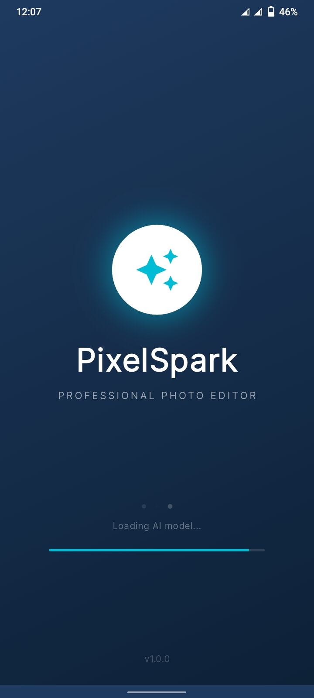
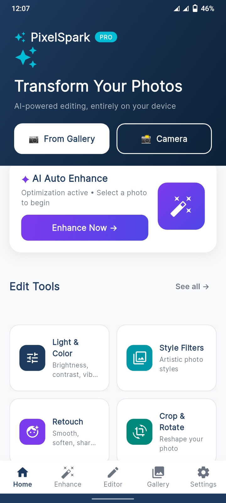
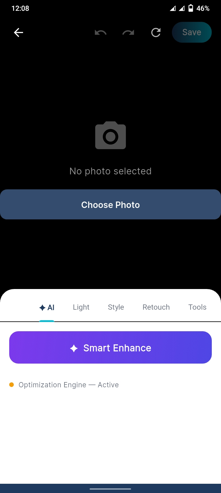
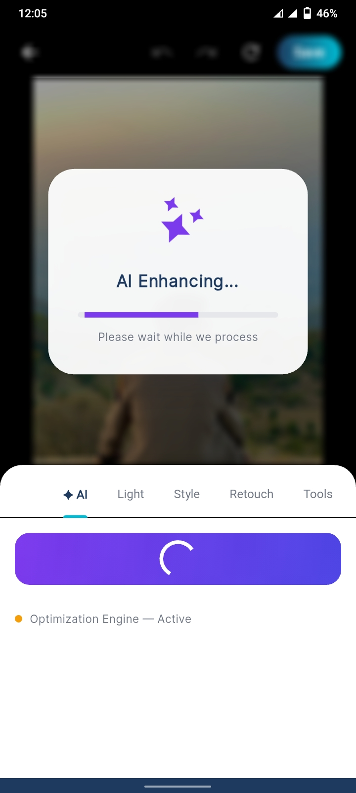
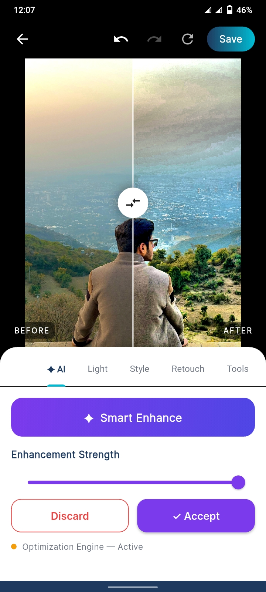
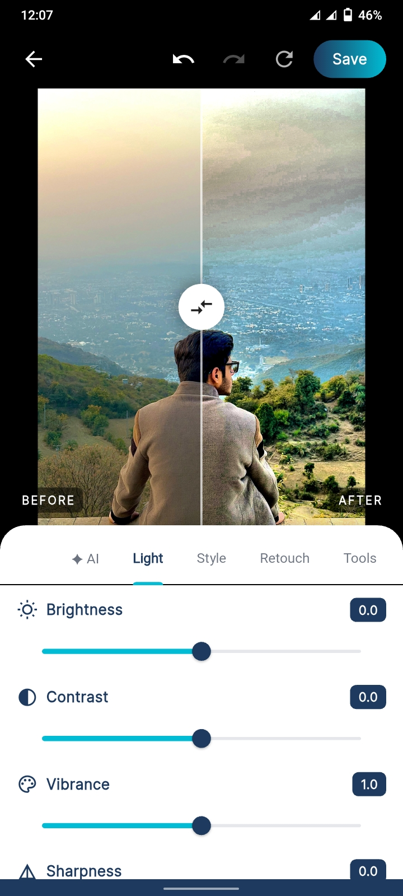
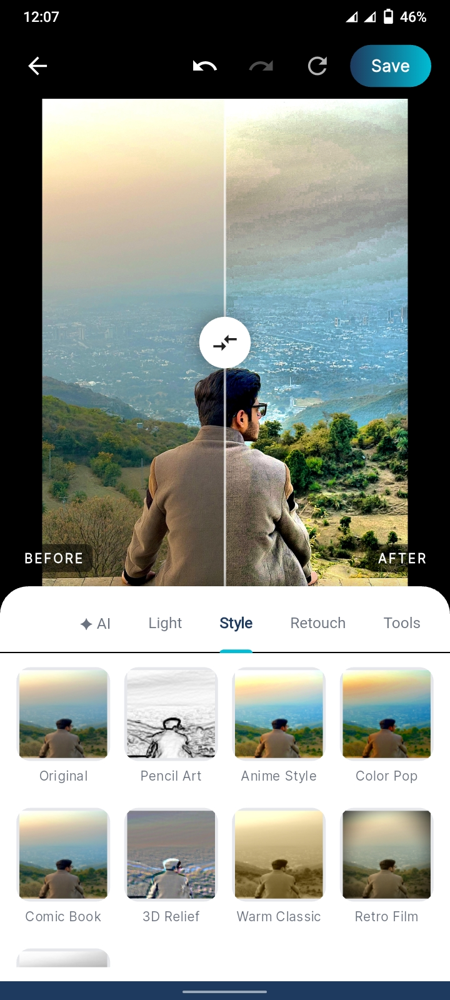
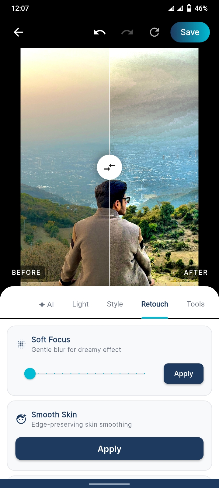
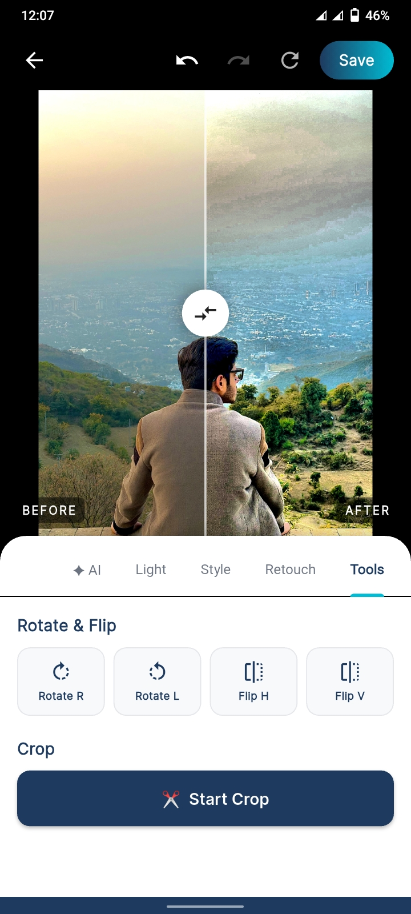

<div align="center">

# ⚡ PixelSpark
### Professional AI Photo Editor for Android

[]()
[]()
[]()
[]()
[]()

*AI-powered photo editing that runs entirely on your device*

---

## 📸 Results Showcase

<table>
  <tr>
    <td></td>
    <td></td>
    <td></td>
  </tr>
  <tr>
    <td></td>
    <td></td>
    <td></td>
  </tr>
  <tr>
    <td></td>
    <td></td>
    <td></td>
  </tr>
</table>

</div>

---

## 🌟 Features

- **100% Offline AI**: Uses MIRNet TFLite to enhance low-light images entirely on device. No internet required.
- **High-Performance C++ Core**: Custom native processing pipeline using `dart:ffi` for maximum speed and efficiency.
- **Non-Destructive Editing**: Robust undo/redo history with memory-efficient JPEG compression.
- **Pro Editing Suite**: 21+ professional tools including AI enhancement, style filters, and manual adjustments.
- **Premium UI/UX**: Modern white and sky-blue aesthetic with smooth animations and responsive layout.

## 🛠 Tech Stack

| Layer | Technologies Used |
|-------|-------------------|
| **Frontend** | Flutter, Provider, Google Fonts, Shimmer |
| **Backend/Core** | C++17, CMake, `dart:ffi` |
| **Machine Learning** | TensorFlow Lite (`tflite_flutter`), MIRNet |
| **Architecture** | Provider State Management, Native Background Isolates |

## 🚀 Quick Start

### 1. Prerequisites
*   **Flutter SDK**: >= 3.10.0
*   **Android SDK**: Platform 35, NDK 26.1.10909125
*   **Java**: JDK 21 (Android Studio bundled is recommended)

### 2. Environment Setup
The project includes automated scripts to handle dependencies and asset generation.

```bash
# Run development build on connected device
./scripts/run.sh

# Build production-ready APK
./scripts/build_apk.sh
```

## 🧰 The Pro Toolset

- **AI Adjustments**: Smart Enhance (MIRNet), Optimization Engine Fallback.
- **Professional Filters**: Pencil Art, Anime Style, Color Pop, Comic Book, 3D Relief, Warm Classic, Retro Film, Black & White.
- **Manual Control**: Brightness, Contrast, Saturation, Sharpness, Exposure, Gamma.
- **Creative Retouch**: Soft Focus, Smooth Skin, Noise Clean, Edge Art, Sketch Style.
- **Geometry**: Rotate, Flip, Free Crop.

## 🧠 Machine Learning Details

PixelSpark features an advanced **MIRNet** architecture optimized for mobile deployment.
- **Model Size**: ~27MB
- **Processing**: Parallel isolate-based inference to keep the UI fluid.
- **Compatibility**: Automatically detects hardware support and selects the optimal processing engine (AI vs Native C++).

## 🤝 Contributing
Contributions are welcome! Please ensure all UI changes adhere to the predefined `AppTheme` and heavy processing is offloaded to isolates via `MLService` or `NativeProcessor`.

## 📜 License
MIT License. See `LICENSE` for details.
